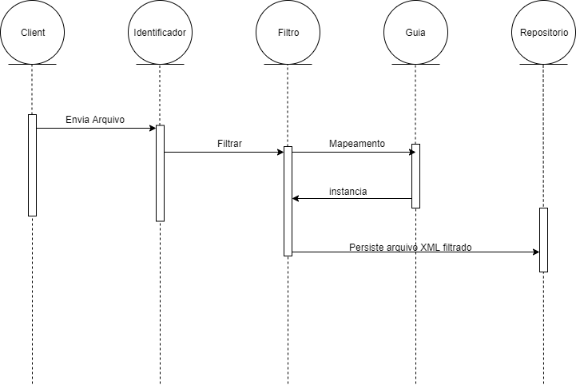
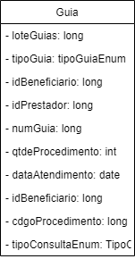

# Projeto da Solução

O design da solução está dividida em três partes para melhor entendimento. A primeira parte conta com um _diagrama de sequencia_ que tem a finalidade de conceituar sobre o fluxo de funcionamento da solução, a segunda que conta com um diagrama das principais classes modelos e uma descrição detalhada sobre a solução. 

!!!Atente-se ao uso do padrão através da documentação especificada nas referencias bibliograficas necessárias.

## Diagrama de Sequencia

## Digrama de Classes

## Descrição Detalhada

 A solução deve ser capaz de identificar a versão(baseado nas versões especificadas no documento de requisitos [requisitos](Especificações_de_Requisitos_e_Tarefas.md)) de um arquivo XML em padrão TISS para Prestadores que traz dados de todos os tipos de guias, fornecido como entrada. Em _posteriori_, deverá ser realizado um filtro dos atributos, independente da versão que for informada. Os atributos filtrados deverão obedecer os atributos especificado na classe *Guia* no diagrama de [classes](#).

Em suma, a solução deve ser capaz de ler um arquivo xml, realizar o filtro dos dados baseados nos atributos especificados e gerar um arquivo xml com estes dados.

#### Bibliografias Necessárias

Documentação Sobre TISS [aqui](http://www.ans.gov.br/prestadores/tiss-troca-de-informacao-de-saude-suplementar/);